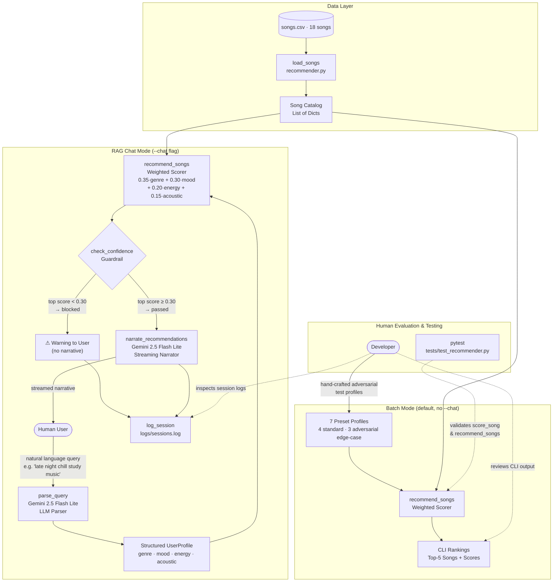
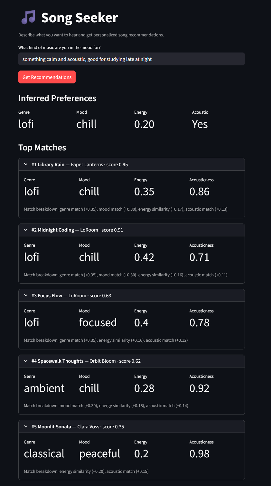
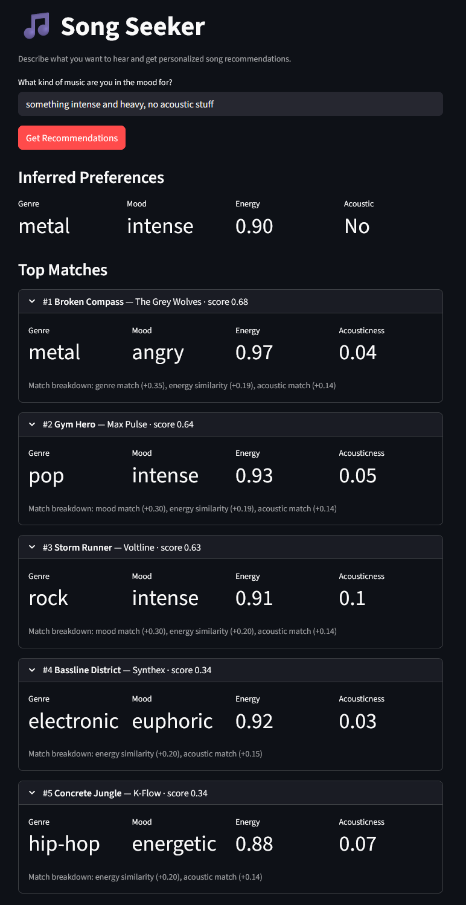
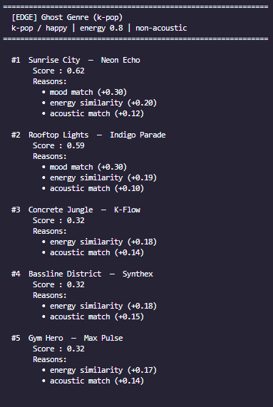

# Song Seeker: Music Recommender with RAG

## 1. Original Project: Song Seeker

The original Song Seeker was a content-based music recommender that scored an 18-song catalog against a user profile. The profile held four attributes (favorite genre, favorite mood, target energy level, and acoustic preference) and each song was ranked using a fixed weighted formula:

```
score = 0.35 * genre_match + 0.30 * mood_match + 0.20 * energy_similarity + 0.15 * acoustic_match
```

The top five results were returned for each profile.

Seven test profiles evaluated the system: four standard (Default Pop / Happy, High-Energy Pop, Chill Lofi, Deep Intense Rock) and three adversarial edge cases (Sad Bangers, Ghost Genre, Acoustic Electronic). The original score system became the retrieval engine for the current system.

## 2. What This Project Does

Song Seeker now accepts natural language. Instead of a preset of profiles, you give a description, such as "something calm for late-night studying" and the system retrieves five songs that best fit the query.

A Retrieval-Augmented Generation (RAG) pipeline wraps the original weighted scorer on both ends: one LLM call parses the natural language query into a structured profile, and a second narrates why the retrieved songs match the request. A confidence guardrail sits between retrieval and generation, blocking low-quality matches before they reach the narrator so the output does not hallucinate.

The RAG pipeline is accessible two ways: a terminal chat loop (`python -m src.main --chat`) and a Streamlit web app (`streamlit run src/app.py`). Both run the same five-step pipeline; the web app adds a browser UI with metric cards for the profile, expandable song results, and narrative description.

## 3. Architecture Overview

The system runs in two modes.

**Batch mode** (default) feeds seven test profiles into the weighted scorer and prints rankings. No API key is required.

**Chat mode** (`--chat`) runs the full five-step RAG pipeline:

1. `parse_query` sends the query to **Gemini 2.5 Flash Lite** and receives a validated `UserProfile` JSON (genre, mood, energy, acoustic).
2. `recommend_songs` scores every song in `songs.csv` and returns the top-5 results with scores and match reasons.
3. `check_confidence` evaluates the top score. Below 0.30, the session is blocked. Between 0.30 and 0.50, a partial-match warning is surfaced but the pipeline continues.
4. `narrate_recommendations` streams a grounded explanation from **Gemini 2.5 Flash Lite**, citing each retrieved song by name and using the score data to justify every claim.
5. `log_session` appends the full session record (query, inferred profile, retrieved songs, confidence result, and narrative) to `logs/sessions.log`.



## 4. Setup

**Prerequisites:** Python 3.9+ · A Gemini API key (chat mode only)

### Installation

1. Clone the repository:
   ```bash
   git clone <repo-url>
   cd applied-ai-music-recommmender
   ```

2. Create and activate a virtual environment:
   ```bash
   python -m venv .venv
   source .venv/bin/activate      # Mac / Linux
   .venv\Scripts\activate         # Windows
   ```

3. Install dependencies:
   ```bash
   pip install -r requirements.txt
   ```

4. Create a `.env` file in the project root and add your Gemini API key (required for chat mode only):
   ```
   GEMINI_API_KEY=your-key-here
   ```

### Running the app

```bash
# Batch mode: runs all 7 preset profiles, no API key needed
python -m src.main

# Chat mode: natural language queries in the terminal
python -m src.main --chat

# Web UI: Streamlit app with the same RAG pipeline
streamlit run src/app.py
```

### Running tests

```bash
python -m pytest
```

## 5. Sample Interactions

Scores are calculated from the actual weighted formula against `data/songs.csv`. The screenshots below are examples of inputs and the resulting AI outputs in the streamlit app.

### Example 1: Strong match (Late-night study session)

The query maps cleanly to lofi/chill. Library Rain and Midnight Coding are the only two songs that match on both genre and mood, putting them far ahead of the rest of the catalog.



### Example 2: Strong match (Acoustic specification)

The query specifies "no acoustic stuff," and the application successfully returns songs that all have low acousticness scores.



### Example 3: Batch mode (Ghost genre edge case)

`favorite_genre = "k-pop"` does not exist in the catalog. Genre weight (0.35) is dead for every song. Results compete on mood, energy, and acoustic preference only, with a score ceiling of ~0.65. This profile passes the confidence guardrail, but the batch runner shows the degradation clearly.



## 6. Design Decisions

**Why keep the original weighted scorer instead of replacing it with embeddings?**

The original scorer is deterministic, meaning every recommendation can be fully explained by the formula. Wrapping it with an LLM on both ends achieves a natural language interface without changing the retrieval logic.

**Why Gemini 2.5 Flash Lite for both the parser and the narrator?**

Gemini 2.5 Flast Lite provides high speed and low cost. The parser only needs a structured JSON response, which Flash Lite produces reliably. The narrator needs streaming, which Flash Lite also supports. Using the same model for both roles reduces the number of API integrations without sacrificing quality at this catalog size.

**The main trade-off** is in the confidence thresholds. The values (0.30 and 0.50) were derived from observations during stress testing on this specific 18-song catalog. They would need recalibration if the catalog grew significantly, since the score distributions would shift as more songs become available for each genre and mood.

## 7. Testing Summary

27 out of 27 tests passed across two files: `test_recommender.py` (15 tests covering `score_song`, `recommend_songs`, and `load_songs`) and `test_rag.py` (12 tests covering confidence guardrail boundary conditions and session logging). All confidence threshold boundaries were verified explicitly at 0.30 and 0.50, confirming correct block/warn/pass behavior at edge values. One caveat: the OOP `Recommender` class uses stub implementations; its two tests pass but cover placeholder behavior rather than production logic.

**What worked:**

The four standard profiles consistently returned the expected top result. Chill Lofi ranked Library Rain and Midnight Coding first and second in every run. The LLM parser correctly mapped natural language to valid catalog attributes across a range of phrasings, including vague requests like "vibes for a dinner party" and direct ones like "maximum intensity metal."

**What didn't:**

The three adversarial profiles exposed the limits of binary string-matching. Sad Bangers, a profile with a sad mood and extreme high energy, was at 0.70 because no catalog song is simultaneously sad and high-energy. Ghost Genre was at 0.62 since no songs share the k-pop genre label. The confidence guardrail correctly surfaces these weak matches, but the system has no way to suggest a broader alternative or explain why the catalog lacks a better fit.

**What I learned:**

Binary genre and mood fields are the scorer's most significant weakness. When a query maps to a genre underrepresented in the catalog, the ranker has no fallback except energy and acousticness. Adding semantic matching between related genres like "rock" and "metal" would address.

## 8. Reflection

Building the RAG layer on top of the prototype improved the system, even though the scorer did not change. The LLM parser removes the ambiguity of natural language and produces a structured profile. The narrator grounds its explanation in the actual retrieved songs. Together, they transform a batch process into a conversational user experience.

The confidence guardrail was the most instructive part of the build. It reinforced the importance of not instinctively trusting the output when building reliable AI systems.

The catalog's sparsity also reinforces the importance of data quality in shaping user experience. Real recommendation systems invest heavily in catalog coverage for this reason.

## 9. Reflection and Ethics: Thinking Critically About Your AI

**What are the limitations or biases in your system?**

The two most significant limitations are catalog sparsity and binary matching. Thirteen of the fifteen genres appear only once, so the scorer's behavior degrades quickly for any query outside pop or lofi. Genre and mood are matched with exact string equality, meaning a fan of "indie pop" gets no credit toward a "pop" query, and "metal" and "rock" are treated as completely unrelated. Because the weights were not derived from user behavior, they may not reflect how actual people prioritize these features. The acoustic preference is also a binary flag, meaning the system treats every user as either an acoustic fan or a non-acoustic fan.

**Could your AI be misused, and how would you prevent that?**

The most realistic misuse risk is confidence in a wrong result. The LLM narrator uses actual retrieved songs and cannot suggest songs not in the retrieved list. However, it still produces a polished explanation even when the underlying match is mediocre. A user might read the narrative and trust that the songs genuinely fit their request.

**What surprised you while testing reliability?**

The quality of results below the top one or two was surprising. Once the genre and mood bonus were used, slots three through five were filled mostly by energy proximity, and those recommendations may be arbitrary.

**Collaboration with AI during this project**

AI was useful throughout the build, but not uniformly. One helpful suggestion was using the `response_schema` parameter in the Gemini API call for `parse_query`. Rather than prompting the model to return JSON and then manually parsing and validating it, the `response_schema` parameter accepts the Pydantic model directly and guarantees the output matches the schema. This removed the need for parsing errors.

One suggestion that was flawed was early in the design, AI recommended adding semantic embeddings for genre and mood matching to replace the binary string equality. That is a real limitation of the current system, but the proposed fix was far too complicated for an 18-song catalog. The complexity was not proportionate to the problem.

## Links

- [Model Card](model_card.md)
